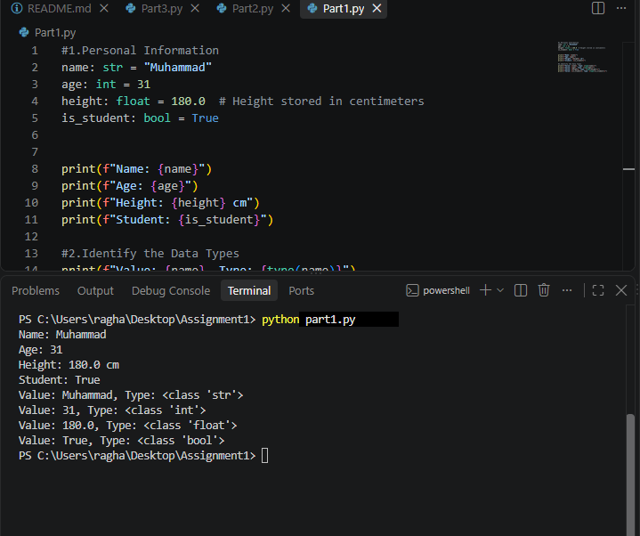
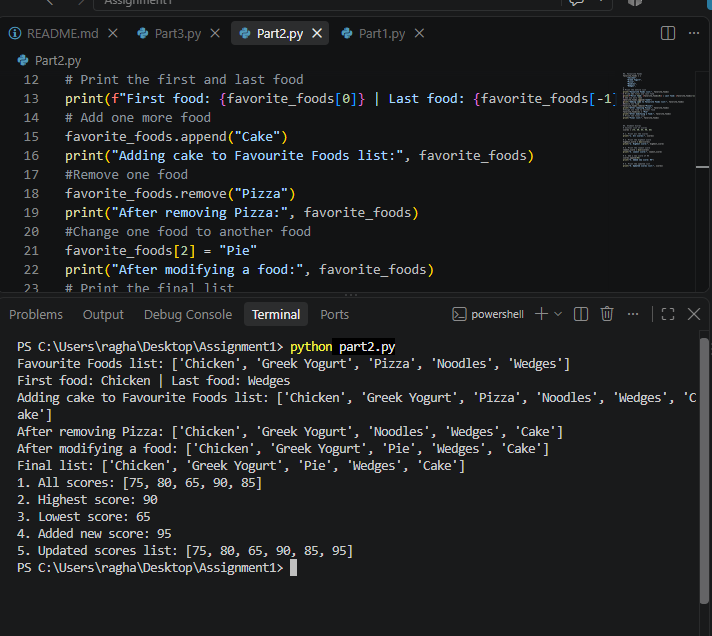
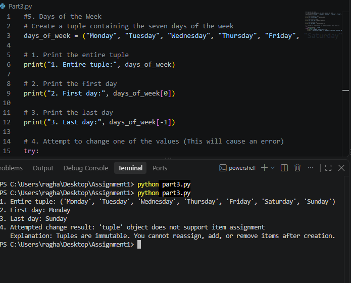
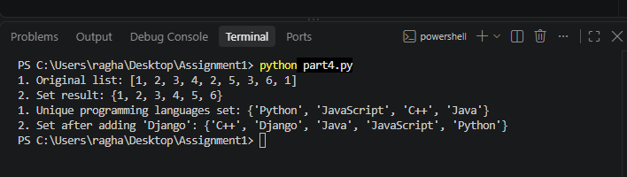
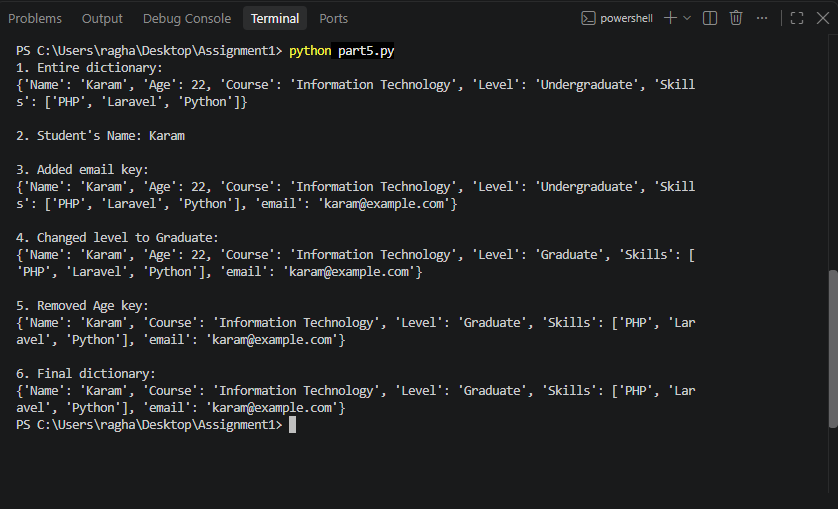
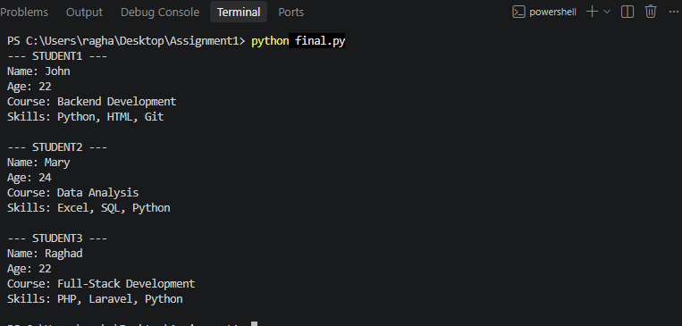
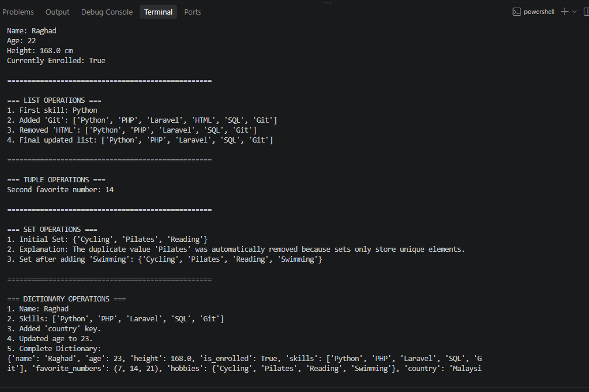
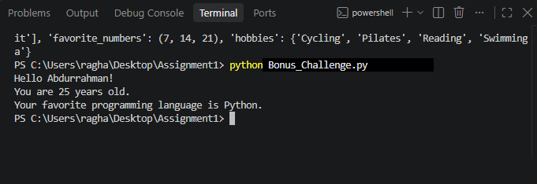

# Python Programming Assignment1

This repository contains my solutions for all assignment tasks.

## Part 1: Basic Variables

* **Code File:** [Part1.py](Part1.py)
* **Program Output:**

---
## Part 2: List Operations

* **Code File:** [Part2.py](Part2.py)
* **Program Output:**

---

## Part 3:Tuple

* **Code File:** [Part3.py](Part3.py)
* **Program Output:**

### Why is a Tuple Different from a List?

* **Lists (`[]`) are mutable:** Elements can be modified, added (`.append()`), or removed (`.remove()`) after the list is created.
* **Tuples (`()`) are immutable:** Once created, the elements cannot be altered, assigned, or removed. Attempting to modify a tuple raises a `TypeError`.

**Key Advantages of Tuples:**
1. **Data Integrity:** Guarantees that constant data (like days of the week) won't be modified accidentally.
2. **Performance:** Tuples are slightly faster and consume less memory than lists.

---

## Part 4: Working with Python Sets

* **Code File:** [Part4.py](Part4.py)
* **Program Output:**

### Why Did Some Values Disappear?

When converting the list `[1, 2, 3, 4, 2, 5, 3, 6, 1]` into a set, the duplicate values (`1`, `2`, and `3`) disappeared because **Python sets only store unique elements**.

**Key Properties of Sets:**
1. **Uniqueness:** A set automatically strips out duplicate items upon creation.
2. **Unordered:** Sets do not maintain sequence index positions like lists or tuples do.

---
## Part 5: Dictionaries

* **Code File:** [Part5.py](Part5.py)
* **Program Output:**

---
## Final chalenge
* **Code File:** [final.py](final.py)
* **Program Output:**

---
## STUDENT INFORMATION MANAGER
* **Code File:** [Student_Information_Manager.py](Student_Information_Manager.py)
* **Program Output:**

---
## Bonus Chalange
* **Code File:** [Bonus_Challenge.py](Bonus_Challenge.py)
* **Program Output:**

---
## A short explanation of the difference between: List,Tuple, Set, Dictionary
* **Code File:** [short_explanation.txt](short_explanation.txt)

